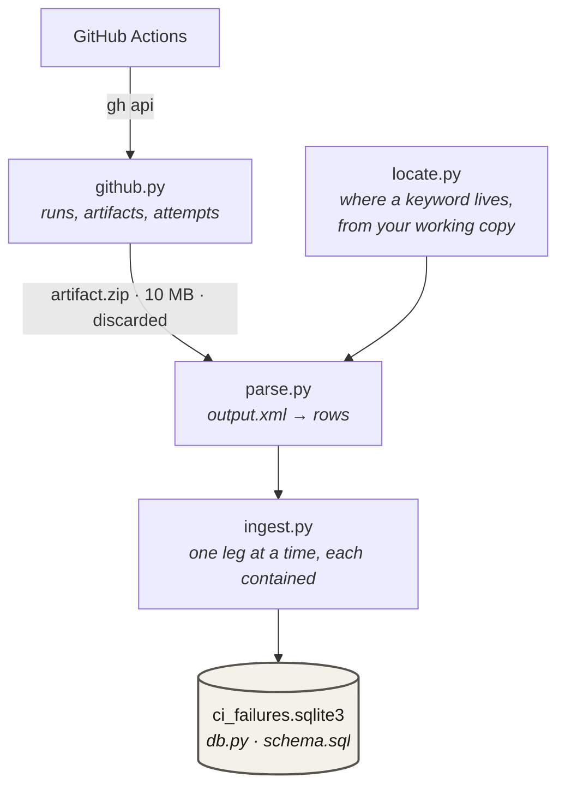
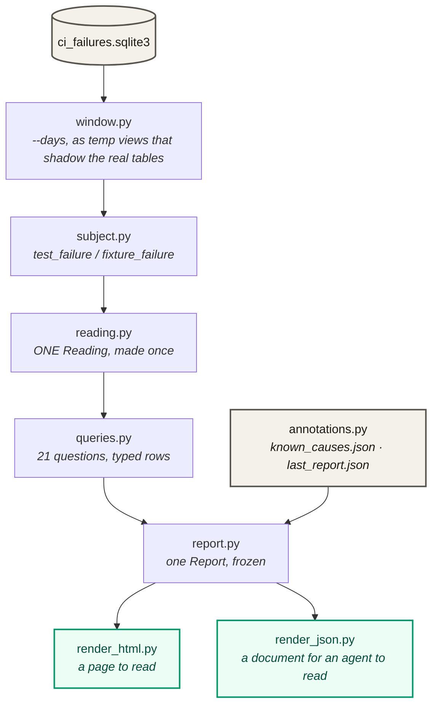

# ci_failures — what fails in CI, how often, and where to start looking

A maintainers' tool. It pulls Robot Framework results out of the artifacts each
GitHub Actions run leaves behind, keeps them in a local SQLite database, and
renders one report: which acceptance tests fail, grouped by the error they fail
with, where in this repository to start looking, and what surrounded each
failure.

It ships with the repository rather than with the package, is excluded from the
wheel, and is not part of the Browser library.

**It does not decide whether a test is flaky.** It assembles the evidence for
that judgement — rates with denominators, what the same matrix leg did in the
runs either side, whether a hand re-run passed, what else broke alongside — and
leaves the conclusion to you. A wrong answer about CI looks exactly like a right
one, so the tool says what it counted and over what.

## Before you start

- **`gh` must be installed and authenticated.** Every request goes through the
  GitHub CLI so that whoever runs this uses the credentials they already have
  and no token is handled here. `gh auth status` should be green.
- **The database is written to `ci_failures/ci_failures.sqlite3`** at the
  repository root, gitignored. It is derived and rebuildable — but only as far
  back as GitHub still has the artifacts, and rebuilding what it does have is
  hours and gigabytes of downloads. See *Retention* and *Three rules* below.
- **Artifacts live 90 days.** That is the whole horizon: a run older than that
  cannot be ingested, re-ingested or checked, and `inv ci-ingest` says so —
  `N artifact(s) expired, unrecoverable`. Everything younger can be fetched
  again at the cost of the download.

## Everyday use

```bash
inv ci-ingest --dry-run           # how many legs an ingest would fetch
inv ci-ingest --limit 25          # pull the newest 25 runs (incremental)
inv ci-ingest --days 14           # ... or the last two weeks, however many runs that is
inv ci-ingest --days 84           # a rebuild: as deep as retention allows (see Retention)

inv ci-report                     # the page, at ci_failures/ci_report.html
inv ci-report --open-it           # ... and open it
inv ci-report --days 3            # only the last three whole local days
inv ci-report --json out.json     # the same report, for a language model
inv ci-report --json a --html b   # both, from one build
inv ci-report --mark-seen         # baseline this report, so the next can diff

inv ci-recompute                  # re-derive what the database can already answer
inv ci-backfill-attempts          # fill in the attempt of very old legs
```

A typical session: `inv ci-ingest` to catch up, `inv ci-report --open-it` to
read the page, then follow the artifact link on whichever occurrence looks worth
opening. Ingest is incremental — legs already stored are never fetched again —
so running it often only costs what is new.

`--days` is the question you ask *after* fixing something: the failures from
before the fix are exactly the ones that must not be counted. It cannot conjure
data that was never ingested: ask for more days than the database holds and you
get what it holds, and the report says so — `window.short` in the document, a
line under the header on the page.

## Retention, and how much history a limit buys

`--limit` counts **runs, not days**, and the exchange rate moves with how busy
the repository is. Measured on 2026-09-03, on `main`, `push` and `schedule`:

| `--limit` | runs | history | note |
| ---: | ---: | --- | --- |
| 25 | 25 | ~8 days | the incremental default |
| 100 | 100 | ~30 days | both events, contiguous |
| 200 | 200 | ~14 weeks | **push runs stop at ~6 weeks**; older than that is `schedule` only |
| 300 | 200 | ~14 weeks | no deeper — one page per event, 100 each, is the ceiling |

So "rebuild it" and "restore what I had" are different requests, and `--limit`
can only answer the first. **Use `--days` for anything deeper than a catch-up.**
It walks both events to the same date rather than to the same count, pages until
it passes the cutoff, and so has no ceiling but retention: `--days 90` reaches
227 runs where `--limit` stopped at 200, and reaches them without the event mix
changing halfway through the window.

`--limit` stays the incremental default, because "the newest 25" is exactly the
right question when you are catching up and costs one request per event. The two
are alternatives and passing both is refused rather than reconciled.

Against 90-day retention that leaves a narrow band: a deep look backwards is
possible while the artifacts live, and impossible afterwards. Losing the
database is therefore losing history, not just time — which is a choice to make
deliberately rather than a cost to be surprised by.

## Architecture

Two halves that meet at the database. One talks to the network and runs once per
ingest; the other never touches it and runs once per report.

### Ingest — needs the network



Downloads one artifact at a time, reads `output.xml` out of it, and throws the
zip away. Nothing but the parsed rows is kept — the artifact URL is stored so
screenshots, traces and `playwright-log.txt` can be fetched later for a failure
that turns out to deserve it. One artifact that will not download, or will not
unzip, or will not parse, costs that leg and nothing else.

`locate.py` is the one part that reads your working copy rather than the
artifact: `output.xml` says which library owns a failing keyword but not where
it lives.

### Read — never touches the network



Builds one **Report** and renders it twice. The Report is frozen dataclasses,
complete and independent of how it is displayed, so the two renderings cannot
quietly drift apart — a test fails if a field reaches one and not the other
without somebody writing down why.

Everything above `report.py` narrows what can be seen: the Window restricts the
tables, the Subject views resolve which rows belong to a test and which to the
suite fixture above it, and a **Reading** is the only thing the queries accept.
By the time a query runs, there is no way for it to ask about the wrong rows.

### The modules

| file | lines | what it is |
| --- | ---: | --- |
| `github.py` | 297 | Finds runs and artifacts through the `gh` CLI. The only module that knows GitHub exists. |
| `parse.py` | 588 | Reads an `output.xml` into rows. Everything the database holds comes from here. |
| `locate.py` | 145 | Where a failing keyword is defined, resolved against your working copy. |
| `ingest.py` | 511 | Drives the two above into the database, one leg at a time, each contained. |
| `db.py` | 83 | Opens the database, adds columns a database predating them has not got. |
| `schema.sql` | 137 | The tables, with the reasoning for each column beside it. |
| `window.py` | 168 | `--days`, as shadowing temp views so no query can forget it. |
| `subject.py` | 87 | `test_failure` and `fixture_failure`, so no query has to remember the rule. |
| `reading.py` | 104 | The database as one Report reads it. The only thing queries accept. |
| `queries.py` | 1170 | Every question asked of the database, and nothing else. |
| `report.py` | 1093 | The Report, and what the numbers mean. |
| `annotations.py` | 183 | Known Causes (by hand, gitignored) and the Snapshot (beside the database). |
| `render_html.py` | 1213 | The page. |
| `render_json.py` | 283 | The document. |

## Layout

```
tools/ci_failures/
├── README.md            # this file
├── CONTEXT.md           # the vocabulary — read this before changing anything
├── docs/adr/            # decisions that should not be re-litigated
├── known_causes.json    # conclusions someone reached, by hand — gitignored
├── schema.sql
└── *.py                 # see the table above

ci_failures/             # gitignored, at the repository root
├── ci_failures.sqlite3  # the database
├── ci_report.html       # the page, when you last rendered one
└── last_report.json     # the Snapshot, when you last took one

utest/test_tool_ci_failures.py   # 195 tests, about a second
```

## Three rules worth knowing before you change anything

**1. There is no re-parse — except for four columns.** Nothing is kept but the
parsed rows, so changing *what* is read out of `output.xml` (the log-line rule,
the screenshot cap, a new column) means deleting the database and downloading
every artifact again. Four derived columns are the exception, because their
source is itself stored, and `inv ci-recompute` re-derives them with no network:
`error_signature` from the message, and `keyword_kind` / `keyword_source` /
`keyword_lineno` from the keyword owner.

Note what "downloading every artifact again" buys, though: everything younger
than 90 days and nothing older. A re-parse late in the database's life is not
the same database with a rule changed — it is the last 90 days of it. Which of
the two the answer needs is worth deciding before deleting anything.

**2. The window is applied to the connection, not to the queries.** A `--days`
report is windowed by temp views that shadow `run`, `leg`, `test_result` and
`log_message` for every statement — inside CTEs and subqueries too. Queries
cannot forget it and cannot disagree about it. The Subject views must stay
**temp** for the same reason: a permanent view resolves against `main`, cannot
see the shadows, and would quietly answer a windowed report from the whole
archive with no error anywhere.

**3. A rendering may show less than the Report holds — but it must say so.**
`PAGE_OMITS` in the test file lists every field the page deliberately leaves
out, with a reason each. Add a field to the Report and a test fails until it
reaches both renderings or joins that list.

## Where the rest of it is

- **`CONTEXT.md`** — the vocabulary. Run, Leg, Attempt, Result, Subject, Group,
  Occurrence, Fixture Failure, Report, Rendering, Window, Reading, Known Cause,
  Snapshot, Adjacent Run, Inconclusive Zero. Worth reading first; the code uses
  these words precisely and means something by each.
- **`docs/adr/`** — why the Report is typed rather than a dict, and why only
  runs where nobody was changing anything are ingested.
- **Module docstrings** — most of the real reasoning lives there, next to the
  code it explains, including the measurements behind several decisions and the
  wrong answers a few of them replaced.

## Development

```bash
inv lint-python                          # ruff format, ruff check, mypy
pytest utest/test_tool_ci_failures.py    # the tool's own tests
```

All three cover `tools/`, and coverage measures it. The tests need no network
and no artifact: `seed()` builds a database directly, and `_run_robot()` produces
a real `output.xml` by running Robot Framework in a temporary directory.
